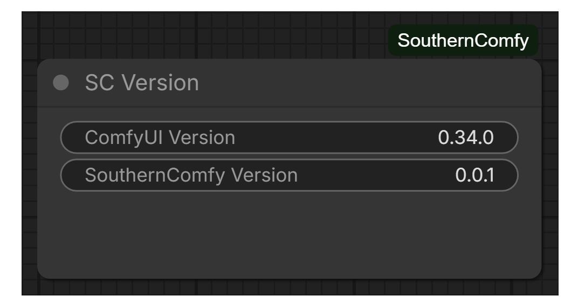
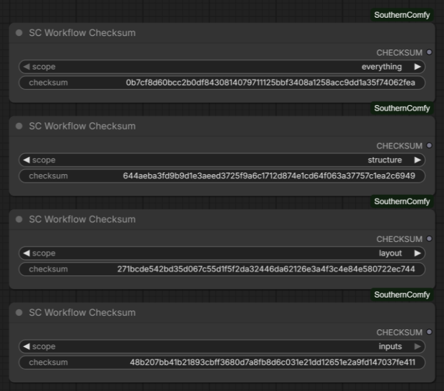

# SouthernComfy

A supplemental pack of quality-of-life custom nodes for [ComfyUI](https://github.com/comfyanonymous/ComfyUI).

SouthernComfy is built to sit alongside a stock ComfyUI installation rather than replace parts of it. Every node follows core ComfyUI conventions for appearance, widgets, sockets, bypass and colour handling, and works under both the legacy LiteGraph renderer and the new **Nodes 2.0** (Vue) renderer.

All nodes are prefixed **`SC`** in the node search and **Add Node** menu, and live under the **SouthernComfy** category.

---

## Table of contents

- [Highlights](#highlights)
- [Installation](#installation)
- [Requirements](#requirements)
- [Node reference](#node-reference)
  - [SC Version](#sc-version)
  - [SC Workflow Checksum](#sc-workflow-checksum)
- [Enhancements](#enhancements)
  - [Filtered dropdowns](#filtered-dropdowns)
- [Example workflows](#example-workflows)
- [Conventions](#conventions)
- [Versioning](#versioning)
- [Licence](#licence)

---

## Highlights

- **No third-party dependencies.** The pack targets a stock ComfyUI portable install and the Python standard library. Nodes that wrap another pack detect it at runtime and degrade gracefully if it is absent.
- **Renderer agnostic.** Nodes render correctly under both the legacy node renderer and Nodes 2.0.
- **Core look and feel.** Standard widgets, sockets, tooltips, per-node help pages, and the usual bypass/mute/colour behaviour.
- **Self-contained.** The pack adds its own nodes, its own HTTP route, and a frontend extension scoped to its own node types. It does not patch ComfyUI internals or alter how other packs behave.

---

## Installation

### Git clone

From your ComfyUI installation's `custom_nodes` directory:

```bash
git clone https://github.com/chmodseven/SouthernComfy.git
```

Then restart ComfyUI. The folder must be named `SouthernComfy`.

### ComfyUI Manager

Not yet published to the ComfyUI Registry. Use the git clone above for now.

### Updating

From the `custom_nodes/SouthernComfy` directory:

```bash
git pull
```

Then restart ComfyUI.

---

## Requirements

| | |
| --- | --- |
| **ComfyUI** | A recent release providing the V3 node schema API (`comfy_api.latest`). Tested against 0.34.0 (frontend 1.51.9). |
| **Python** | 3.10 or newer (matching ComfyUI's own requirement). |
| **Dependencies** | None. |

If the host ComfyUI is too old to provide the V3 node API, the pack loads inertly and logs an actionable message to the ComfyUI console instead of failing the start-up.

---

## Node reference

| Node | Category | Summary |
| --- | --- | --- |
| [**SC Version**](#sc-version) | `SouthernComfy/utils` | Displays the running ComfyUI version and the SouthernComfy pack version. |
| [**SC Workflow Checksum**](#sc-workflow-checksum) | `SouthernComfy/utils` | Live checksum of the workflow, over a selectable scope. |

---

### SC Version

Displays the version of the running ComfyUI installation and the version of this node pack, on two labelled rows. Handy when filing an issue, or for confirming which versions a workflow was authored against.



| Row | Meaning |
| --- | --- |
| **ComfyUI Version** | Version of the running ComfyUI installation, e.g. `0.34.0`. |
| **SouthernComfy Version** | Version of the installed SouthernComfy node pack, e.g. `0.0.1`. |

**Inputs and outputs** — none. The node is purely informational, so it never joins the execution graph and costs nothing to leave in a workflow.

**Notes**

- The values appear as soon as the node is added; there is no need to run the workflow.
- Both rows are read only under the legacy renderer and under Nodes 2.0.
- The versions are re-read from the running installation each time the node is created, so a workflow saved against an older version still reports what you are actually running.
- A workflow containing only this node has nothing to execute, so ComfyUI reports "Prompt has no outputs". Add it alongside the rest of your graph.

---

### SC Workflow Checksum

Produces a deterministic checksum of the workflow the node sits in, so you can tell whether a
workflow, its values, or both have changed. The displayed value updates live as you edit the
canvas — no run required.



*Screenshot pending.*

| Scope | Covers | Changes when |
| --- | --- | --- |
| `everything` | Structure, layout and values | Any change at all |
| `structure` | Nodes, wiring, bypass/mute state | You add, delete, rewire or bypass a node |
| `layout` | The above plus positions, sizes, titles, colours, collapsed state and groups | Also when you move, resize, recolour or group nodes |
| `inputs` | Widget values only | You edit any value — or add/remove a node that had values |

**Output** — `CHECKSUM` (`STRING`), the full SHA-256 hex digest for the selected scope.

The node face shows as much of the digest as fits, trailed by `...` to make clear there is more.
**Widen the node to reveal more of it**; at full width the whole 64-character digest is shown and
the `...` disappears. Narrowing it again brings the `...` back. The socket always carries all 64
characters regardless of how the node is sized.

`structure` is the scope to compare before restoring saved input values into a workflow, because it
changes precisely when those saved values would no longer line up.

Two behaviours worth knowing about the `inputs` scope:

- It **ignores node identity**. Deleting a node and re-adding an identical one, or packing a
  selection into a subgraph and unpacking it again, renumbers nodes without changing any value —
  so the digest returns to exactly what it was. `structure` and `layout` still change, because
  structurally those really are different graphs.
- It **reaches inside subgraphs**. Packing nodes away moves them into a subgraph definition; their
  values keep counting. The subgraph's own instance node is skipped, since the widgets promoted
  onto it are copies of ones still held by the nodes inside.


## Randomised seeds and the run

Any widget set to **randomize** or **increment** — a KSampler seed, typically — is advanced by
ComfyUI the instant you press Run, *after* the workflow has been submitted. So on any graph with
such a widget:

- The `inputs` and `everything` scopes change with **every run**, even if you touch nothing.
- The value shown on the node face is one step **ahead** of the value its output sent downstream.
  The face describes the workflow as it is now; the output describes the workflow that actually
  ran — both are correct, they are answering different questions.

Set those widgets to `fixed` if you need the displayed and emitted values to agree. `structure` and
`layout` are unaffected either way, since a seed is neither wiring nor presentation.

**Notes**

- Some things never affect any scope, because they change for reasons unrelated to the workflow's
  content: link ids (reassigned freely without the wiring changing), canvas pan/zoom, and the
  computed execution `order` (ComfyUI recalculates it per run, so it drifts on its own).
- **Also counted as `layout`:** native reroute waypoints (adding, moving or removing one) and
  core's Parameters-sidebar favourites, both of which are saved in the workflow.
- **Not counted:** `floatingLinks` (a link with a dangling end). `graph.serialize()` and the
  workflow attached to a prompt do not always agree on that field, and hashing it risks the
  displayed and executed digests disagreeing. A floating link cannot affect execution, and the
  real link's removal is caught by `structure` anyway.
- **Node `properties` are not hashed**, apart from those SouthernComfy owns — such as a saved
  dropdown filter. `properties` is an unpoliced grab-bag: as well as provenance (`ver`, `cnr_id`)
  and genuine settings, nodes stash *runtime results* there. Core's Save 3D Model writes the last
  saved filename and a live camera position after every execution, which would otherwise change
  `layout` on every single run without you touching anything. Everything a node actually presents
  — position, size, title, colour, collapsed state, groups — has its own field and is hashed
  from there.
- An `SC Workflow Checksum` node contributes no values of its own to the `inputs` scope — it
  observes the workflow rather than configuring it, and hashing the digest it displays would make
  the result self-referential. Adding or removing one still counts as a structural change.
- The digest is computed on the server, so every node in the pack that needs one always agrees.

---

## Enhancements

Not every improvement wants to be a node. These attach to what is already there.

### Filtered dropdowns

Sets a **persistent filter** on any dropdown — base or third-party — so a long list of
checkpoints, LoRAs or samplers stays narrowed to what you actually use.

ComfyUI already offers an ad-hoc "Filter list" box while a dropdown is open, but it forgets what
you typed as soon as you close it. This one is saved with the workflow.

**Setting a filter** — right-click the node, choose **SC Combo Filter**, and pick the dropdown to
filter. Enter either:

| Filter | Matches |
| --- | --- |
| `qwen3` | Anything containing "qwen3", case-insensitive |
| `/^sdxl/i` | A regular expression, between slashes, with the usual flags |

An empty filter clears it. A filtered dropdown shows its filter in the widget label, so an active
filter is never invisible — `clip_name  [qwen3]`.

**Notes**

- **A value outside the filter is cleared.** Setting a filter says that only matching values are
  wanted from now on, which makes any existing value suspect — so it is set to `null` and must be
  reselected from the narrowed list. A filter matching nothing likewise empties the dropdown and
  clears the value, so the filter itself has to be corrected.
- This also applies when a **saved workflow is opened**: a value that no longer matches, because
  the filter was edited elsewhere or the underlying file was removed, is cleared on load and must
  be reselected before the workflow will run.
- The filter is stored in the node's `properties` as `sc_filter:<widget>`, so it saves and restores
  with the workflow. Nodes you have never filtered carry no trace of the feature.
- Because the filter attaches to the real widget, there is no `control_after_generate` widget to
  hide — that only appears on the primitive-node route this deliberately avoids.
- Works under both the legacy renderer and Nodes 2.0.

---

## Example workflows

The `example_workflows/` directory holds workflows exported straight from ComfyUI. Load one with
**Workflow → Open**, or drag the `.json` file onto the ComfyUI canvas.

| Workflow | Shows |
| --- | --- |
| `sc_version.json` | The **SC Version** node on its own, reporting the running ComfyUI and SouthernComfy versions. |

Because SC Version is purely informational, this workflow has nothing to execute — running it
reports "Prompt has no outputs", which is expected. It is there to demonstrate the node; drop the
node into a graph of your own to use it for real.

---

## Conventions

These conventions apply to every node in the pack.

| Aspect | Convention |
| --- | --- |
| **Pack name** | Always written **`SouthernComfy`**, one word, never "Southern Comfy". Applies to prose, node labels, help pages and console messages alike. |
| **Display name** | Prefixed `SC`, e.g. `SC Version`. |
| **Node ID** | Prefixed `SC_`, e.g. `SC_Version`. Never changed after release, so saved workflows keep working. |
| **Category** | Rooted at `SouthernComfy`, with a sub-category by purpose, e.g. `SouthernComfy/utils`. |
| **Socket names** | Inputs are lower case (`image`, `strength`); outputs are UPPER CASE (`IMAGE`, `LATENT`), matching core ComfyUI. |
| **Help pages** | Each node ships a markdown help page, reachable from the node's help button in ComfyUI. |
| **Screenshots** | Captured with the legacy node renderer, for a consistent look across the documentation. Nodes are tested under both renderers regardless. |
| **Third-party wrappers** | Nodes that wrap another pack check for it at import time and are only registered when it is present. |

---

## Versioning

SouthernComfy uses a `MAJOR.MINOR.ITERATION` scheme. The current version is reported by the [SC Version](#sc-version) node.

**Current version: `0.0.1`**

---

## Licence

[MIT](LICENSE) © Shannon Rowe
