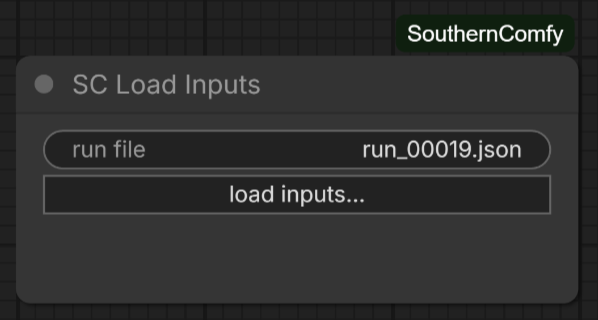
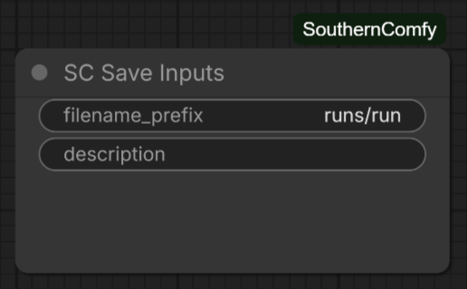
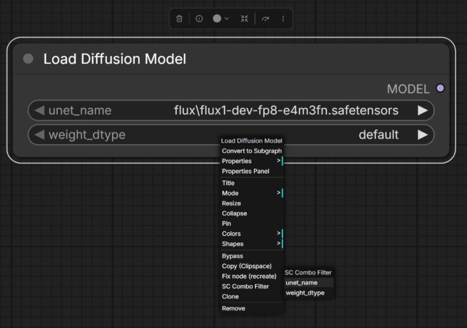
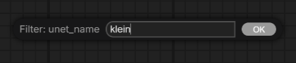
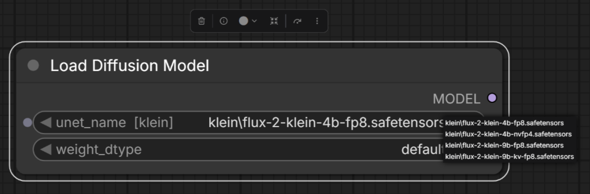
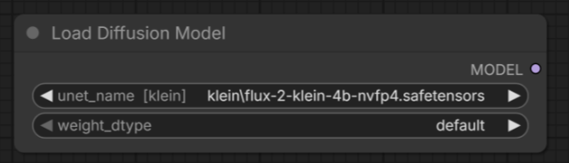

# SouthernComfy

A supplemental pack of quality-of-life custom nodes for [ComfyUI](https://github.com/comfyanonymous/ComfyUI).

SouthernComfy is built to sit alongside a stock ComfyUI installation rather than replace parts of it. Every node follows core ComfyUI conventions for appearance, widgets, sockets, bypass and color handling, and works under both the legacy LiteGraph renderer and the new **Nodes 2.0** (Vue) renderer.

All nodes are prefixed **`SC`** in the node search and **Add Node** menu, and live under the **SouthernComfy** category.

---

## Table of contents

- [Highlights](#highlights)
- [Installation](#installation)
- [Requirements](#requirements)
- [Node reference](#node-reference)
  - [SC Label](#sc-label)
  - [What these two are for](#what-these-two-are-for)
  - [SC Load Inputs](#sc-load-inputs)
  - [SC Save Inputs](#sc-save-inputs)
  - [SC Version](#sc-version)
  - [SC Workflow Checksum](#sc-workflow-checksum)
- [Enhancements](#enhancements)
  - [SC Combo Filter](#sc-combo-filter)
- [Example workflows](#example-workflows)
- [Conventions](#conventions)
- [Versioning](#versioning)
- [Licence](#licence)

---

## Highlights

- **No third-party dependencies.** The pack targets a stock ComfyUI portable install and the Python standard library. Nodes that wrap another pack detect it at runtime and degrade gracefully if it is absent.
- **Renderer agnostic.** Nodes render correctly under both the legacy node renderer and Nodes 2.0.
- **Core look and feel.** Standard widgets, sockets, tooltips, per-node help pages, and the usual bypass/mute/color behaviour.
- **Self-contained.** The pack adds its own nodes, its own HTTP route, and a frontend extension scoped to its own node types. It does not patch ComfyUI internals or alter how other packs behave.

---

## Installation

### Git clone

From your ComfyUI installation's `custom_nodes` directory:

```bash
git clone https://github.com/chmodseven/SouthernComfy.git
```

Then restart ComfyUI. The folder must be named `SouthernComfy`.

### ComfyUI Manager

Not yet published to the ComfyUI Registry. Use the git clone above for now.

### Updating

From the `custom_nodes/SouthernComfy` directory:

```bash
git pull
```

Then restart ComfyUI.

---

## Requirements

| | |
| --- | --- |
| **ComfyUI** | A recent release providing the V3 node schema API (`comfy_api.latest`). Tested against 0.34.0 (frontend 1.51.9). |
| **Python** | 3.10 or newer (matching ComfyUI's own requirement). |
| **Dependencies** | None. |

If the host ComfyUI is too old to provide the V3 node API, the pack loads inertly and logs an actionable message to the ComfyUI console instead of failing the start-up.

---

## Node reference

| Node | Category | Summary |
| --- | --- | --- |
| [**SC Label**](#sc-label) | `SouthernComfy/utils` | Text on the canvas with no title bar and no badge, for annotating a workflow. |
| [**SC Load Inputs**](#sc-load-inputs) | `SouthernComfy/utils` | Restores the input values of an earlier run into this workflow. |
| [**SC Save Inputs**](#sc-save-inputs) | `SouthernComfy/utils` | Writes every input value in the workflow to JSON on each run. |
| [**SC Version**](#sc-version) | `SouthernComfy/utils` | Displays the running ComfyUI version and the SouthernComfy pack version. |
| [**SC Workflow Checksum**](#sc-workflow-checksum) | `SouthernComfy/utils` | Live checksum of the workflow, over a selectable scope. |

---

### SC Label

A piece of text on the canvas, with **no title bar and no badge** — for captioning a group, naming
a branch, or leaving a word beside a wire.

Every pack has a note node, and they all draw a titled, badged box. That is right for a note and
wrong for a caption: a heading over a section of a workflow should look like writing on the canvas,
rather than like another node in it.

> **Screenshot pending** — to be added.

**Double-click the text** to edit it. `Enter` or clicking away saves, `Shift+Enter` starts a new
line, and `Escape` abandons the edit. Text wraps to the node's width and reflows as you resize; if
there is more than fits, a slim scrollbar appears, taking its color from the text. Drag the label by
anywhere on its body — there is no title bar to grab, so the whole node is the handle.

**It grows with what you type**, a line at a time, so a caption being written stays on screen
instead of scrolling away above the caret — and shrinks again as text is deleted. That stops the
first time you resize the label yourself: from then on the size you chose is the size it keeps, and
text beyond it scrolls.

**Inputs and outputs** — none. The node never joins the execution graph.

**Appearance** — a new label is **white text with no background at all**, sitting directly on the
canvas. Right-click it for **SC Label Font Size**, **SC Label Text Color**, **SC Label Background
Color** and **SC Label Reset Colors** — the color items open a swatch and a hex box at the pointer,
with **None** for no background at all. Give it a background and the box appears. An empty label
draws a faint dashed outline so it cannot become invisible and unselectable.

The rest are ordinary node properties (`sc_text`, `sc_font_size`, `sc_align`, `sc_autosize`), saved
with the workflow and edited in the properties panel under the legacy renderer. Nodes 2.0 has no
properties panel, which is why the colors and the point size are on the menu.

**Notes**

- **Annotating is not configuring.** The text lives in node properties rather than widget values,
  so editing a caption moves the workflow's `layout` checksum and leaves `inputs` and `structure`
  untouched.
- **`SC Load Inputs` never rewrites a label.** Returning to the values of an earlier run restores
  parameters, not commentary.
- Headerless in both renderers, and it needs no custom canvas drawing to be so: `title_mode` is a
  standard LiteGraph property that core uses for its own `Reroute` node.

---

### What these two are for

**SC Save Inputs** and **SC Load Inputs** are the manual, granular half of run recording: a backup
of the values a run used, and a way to put them back on demand. They are also the shared machinery
behind **SC Run History**, which is where most of this is meant to be used day to day — an
automatic list of runs you click to restore, rather than files you name and pick yourself.

They suit a **finished workflow** best: one whose shape is settled, where you are changing prompts
and tweaking a few settings between runs. You can use them on a workflow still under construction,
with nodes being added and swapped — nothing stops you, and a restore does as much as it honestly
can — but expect refusals and partial results there. Values belong to the nodes that held them, and
a graph being rebuilt around them is exactly where "which node did this belong to?" stops having a
clean answer.

---

### SC Load Inputs

Pastes the values of an earlier run back into this workflow, from a file written by
[SC Save Inputs](#sc-save-inputs). For returning to settings you liked, flipping between test
configurations, or undoing an afternoon of fiddling in one click.



Press **load inputs…**, pick a file — they land in `output/runs/` by default — and the values are
restored. The `run file` row then shows what was last loaded.

**Inputs and outputs** — none. The node never joins the execution graph, and could not do this work
there if it did: ComfyUI's execution is pull-based, so a node receives its own inputs and has no way
to write into another node's widgets. The restoring happens in the browser, against the live graph.

**What it restores** — everything the file holds for each node, matched by **id and type**: widget
values (including `control_after_generate`, and nodes inside subgraphs), **node properties**, and
any custom state a node serialised of its own. Properties are set through `setProperty` where
LiteGraph offers it, so a node that reacts to its own settings changing gets that chance.
Provenance properties are never restored. State only: your wiring, positions, titles and colors
are untouched — that is the difference between this and dragging a saved image onto the canvas,
which replaces the entire workflow.

**When it refuses** — the file is checked twice, and a refusal changes nothing at all. First, that
it is one of ours: a stray `.json` from the output folder, or a file from a newer SouthernComfy, is
refused by name. Second, that its values still have somewhere to land — every node the file holds
values for must still be on the canvas, with the same id and type:

| Since you saved | Result |
| --- | --- |
| You edited values | **Fine** — that is the whole point |
| You moved, resized, recolored or retitled nodes | **Fine** |
| You **added** nodes, or rewired existing ones | **Fine** — an addition cannot disturb values already there |
| You **deleted** or **retyped** a node that had saved values | **Refused** — those values have nowhere correct to go |

Adding nodes is deliberately allowed. Comparing whole-workflow checksums asks the wrong question:
it would refuse a record merely because the graph had grown — and, since this is itself a node, a
record saved before you added SC Load Inputs could never be loaded by it. Restoring into a workflow
that has moved on is the ordinary case, not the exception.

**Deleting and re-adding a node** is handled too. ComfyUI never reuses a node id, so putting an
identical node back leaves the graph behaving exactly as before while the record still points at an
id that is gone — and only an *undo* recovers that id, not re-adding. A value whose id has vanished
may therefore claim a same-type node in the same subgraph that nothing else has claimed, but only
where the choice is forced: titles settle it first, then a pairing is accepted only if exactly one
value and one candidate remain. Two indistinguishable candidates are left unplaced rather than
guessed between. When this happens the result says the graph appears to have been rebuilt, and
names what was matched by type.

**A change is reported, not refused**, with the distinction the checksums make available: *the
structure has changed* (nodes added, removed or rewired) or *the workflow has been rearranged but
its structure is unchanged* (only positions, sizes, titles or colors). Neither is a problem — they
explain a result that might otherwise look partial.

**Afterwards** it reports how many values were restored and anything it could not do: node types
whose widgets did not match (almost always an uninstalled node pack — ComfyUI substitutes a
placeholder whose widgets are all named `UNKNOWN`), nodes that were not found or had changed type,
and any widget that will advance again.

**Notes**

- **A restored seed does not necessarily stay restored.** A widget set to `randomize`, `increment`
  or `decrement` is advanced by ComfyUI the instant you press Run, replacing the value you just put
  back — which looks exactly like a restore that silently failed. The node warns you and names the
  widget; set it to `fixed` if you want the seed you restored to be the seed that runs.
- The file is read in your browser and never uploaded. The *deciding* is done by the server, so the
  rules a record is written by and read by are the same rules.
- This node contributes no values to the `inputs` checksum, and none to a file saved by SC Save
  Inputs. The file it last loaded is a note about what you did, not a setting a run uses — and
  counting it would mean a restored workflow could never match the checksum of the file it was
  restored from. SC Save Inputs' own `filename_prefix` is left out of a restore for a related
  reason: going back to old values should not quietly move where future runs are written.
- Browsers hand over a file's name but never its path, so the `run file` row cannot be used to
  reload the same file — press the button again and pick it.
- Every result stays on screen until dismissed, and is written to the browser console as well, so a
  message you closed or one from earlier in the session can still be read back.
- Works under both the legacy renderer and Nodes 2.0.

---

### SC Save Inputs

Writes every input value in the workflow to a JSON file in the output folder, each time the
workflow runs — a record of what a run was actually invoked with. Load one back with
[SC Load Inputs](#sc-load-inputs) to return to a run you liked.



Drop the node anywhere on the canvas. Nothing needs to be wired to it: the values it records reach
it as metadata describing the whole prompt, not as inputs of its own, so where it sits makes no
difference to what it captures.

| Input | Type | Meaning |
| --- | --- | --- |
| `filename_prefix` | `STRING` | Where to write the file, relative to the output folder. Default `runs/run`. |
| `description` | `STRING` | Optional one-line note about the run — *"denoise down to 0.9"*. Stored at the top of the file and shown when it is loaded. |

**Inputs and outputs** — none besides the widget above. The node is an output node, which is what
makes ComfyUI schedule it, but it produces nothing for anything else to consume.

**The prefix works exactly as Save Image's does** — the same ComfyUI code produces it:

- `runs/run` writes `output/runs/run_00001.json`, then `run_00002.json`, and so on. The number is
  read from the folder, so it keeps counting across restarts and never overwrites an earlier run.
- The date substitutions work too — `%year%`, `%month%`, `%day%`, `%hour%`, `%minute%`, `%second%`.
  A prefix of `runs/%year%-%month%-%day%/run` starts a fresh numbered set each day.
- A prefix that would write outside the output folder is refused.

**The file is written twice** — once as the run starts, once when it ends. ComfyUI gives a custom
node no post-execution hook and no way to arrange to run last, so the record is written on execution
(the inputs are already fixed by then) and rewritten when the run finishes with its outcome,
duration and memory figures. A run that never finishes still leaves a file, with `run.status` left
at `running`.

**What lands in the file**

| Key | Contents |
| --- | --- |
| `format`, `format_version` | Identify the file as one of ours, and which shape it is in |
| `pack_version` | The SouthernComfy version that wrote it |
| `description` | Your one-line note, if you set one |
| `saved_at` | Local time the run started, with its UTC offset |
| `run` | Outcome (`success` / `error` / `interrupted`), duration, cached-node count, failing node, and RAM/VRAM at start and end |
| `checksums` | All four workflow checksums — `everything`, `structure`, `layout`, `inputs` |
| `nodes` | Every node's restorable state — the half that gets restored |
| `resolved` | The literal values the backend actually received |

There is no per-node timing, because ComfyUI records none: it timestamps the run's start and end
and nothing in between.

`nodes` holds one entry per node with any state: its `values` (widget values, keyed by widget
name), its `properties`, and any `extra` state it serialised of its own. **Properties matter more
than they sound** — across a 26-workflow sample they held every third-party setting that turned up
(cg-use-everywhere, rgthree's group togglers, Reroute's orientation, core's `Node name for S&R`)
while exactly one such setting lived anywhere else, so capturing widgets alone would leave a real
part of a workflow behind. Provenance properties (`ver`, `cnr_id`, `aux_id`, `models`) are excluded,
since ComfyUI maintains those itself.

Nodes inside a subgraph are captured as well, tagged with the body they came from; the subgraph's
own instance node is skipped, since the widgets promoted onto it are copies of ones still held
inside. This pack's own bookkeeping is left out — SC Workflow Checksum's digest, SC Load Inputs'
last file, and this node's own `filename_prefix`.

`resolved` is the same run seen from the backend, and is never restored — it is the record of what
happened. It can legitimately differ from `nodes`: a widget converted into an input still carries
its last typed value in the workflow, while `resolved` shows the value that came down the wire.
Frontend-only controls such as `control_after_generate` appear only in `nodes`.

**Why all four checksums** — so the file can answer any of their questions without needing the
workflow itself. `structure` says whether the graph itself has changed; SC Load Inputs reports a
difference as a note rather than refusing over it. `layout` is the strict "identical but for
the values" comparison, `inputs` fingerprints the values alone, and `everything` is the catch-all.
See [SC Workflow Checksum](#sc-workflow-checksum) for what each scope covers.

**Notes**

- The node re-runs on every execution rather than being cached. It has to: ComfyUI decides what to
  cache from a node's declared inputs, and this node's only declared input is where to write, while
  what it records is the whole workflow. Cached, it would silently record nothing after the first
  run.
- Two of these in one workflow write two files, even with the same prefix.
- The record describes the prompt **as submitted**. A widget set to `randomize` or `increment` is
  advanced the instant you press Run, so what is saved is the value that actually ran rather than
  the one now showing on the canvas.
- A run started straight from the API carries no workflow metadata. The file is still written, with
  `resolved` filled in and `nodes` empty.
- Works under both the legacy renderer and Nodes 2.0.

---

### SC Version

Displays the version of the running ComfyUI installation and the version of this node pack, on two labelled rows. Handy when filing an issue, or for confirming which versions a workflow was authored against.


| Row | Meaning |
| --- | --- |
| **ComfyUI Version** | Version of the running ComfyUI installation, e.g. `0.34.0`. |
| **SouthernComfy Version** | Version of the installed SouthernComfy node pack, e.g. `0.0.1`. |

**Inputs and outputs** — none. The node is purely informational, so it never joins the execution graph and costs nothing to leave in a workflow.

**Notes**

- The values appear as soon as the node is added; there is no need to run the workflow.
- Both rows are read only under the legacy renderer and under Nodes 2.0.
- The versions are re-read from the running installation each time the node is created, so a workflow saved against an older version still reports what you are actually running.
- A workflow containing only this node has nothing to execute, so ComfyUI reports "Prompt has no outputs". Add it alongside the rest of your graph.

---

### SC Workflow Checksum

Produces a deterministic checksum of the workflow the node sits in, so you can tell whether a
workflow, its values, or both have changed. The displayed value updates live as you edit the
canvas — no run required.


| Scope | Covers | Changes when |
| --- | --- | --- |
| `everything` | Structure, layout and values | Any change at all |
| `structure` | Nodes, wiring, bypass/mute state | You add, delete, rewire or bypass a node |
| `layout` | The above plus positions, sizes, titles, colors, collapsed state and groups | Also when you move, resize, recolor or group nodes |
| `inputs` | Widget values only | You edit any value — or add/remove a node that had values |

**Output** — `CHECKSUM` (`STRING`), the full SHA-256 hex digest for the selected scope.

The node face shows as much of the digest as fits, trailed by `...` to make clear there is more.
**Widen the node to reveal more of it**; at full width the whole 64-character digest is shown and
the `...` disappears. Narrowing it again brings the `...` back. The socket always carries all 64
characters regardless of how the node is sized.

`structure` is the scope to compare before restoring saved input values into a workflow, because it
changes precisely when those saved values would no longer line up.

Two behaviours worth knowing about the `inputs` scope:

- It **ignores node identity**. Deleting a node and re-adding an identical one, or packing a
  selection into a subgraph and unpacking it again, renumbers nodes without changing any value —
  so the digest returns to exactly what it was. `structure` and `layout` still change, because
  structurally those really are different graphs.
- It **reaches inside subgraphs**. Packing nodes away moves them into a subgraph definition; their
  values keep counting. The subgraph's own instance node is skipped, since the widgets promoted
  onto it are copies of ones still held by the nodes inside.


## Randomised seeds and the run

Any widget set to **randomize** or **increment** — a KSampler seed, typically — is advanced by
ComfyUI the instant you press Run, *after* the workflow has been submitted. So on any graph with
such a widget:

- The `inputs` and `everything` scopes change with **every run**, even if you touch nothing.
- The value shown on the node face is one step **ahead** of the value its output sent downstream.
  The face describes the workflow as it is now; the output describes the workflow that actually
  ran — both are correct, they are answering different questions.

Set those widgets to `fixed` if you need the displayed and emitted values to agree. `structure` and
`layout` are unaffected either way, since a seed is neither wiring nor presentation.

**Notes**

- Some things never affect any scope, because they change for reasons unrelated to the workflow's
  content: link ids (reassigned freely without the wiring changing), canvas pan/zoom, and the
  computed execution `order` (ComfyUI recalculates it per run, so it drifts on its own).
- **Also counted as `layout`:** native reroute waypoints (adding, moving or removing one) and
  core's Parameters-sidebar favourites, both of which are saved in the workflow.
- **Not counted:** `floatingLinks` (a link with a dangling end). `graph.serialize()` and the
  workflow attached to a prompt do not always agree on that field, and hashing it risks the
  displayed and executed digests disagreeing. A floating link cannot affect execution, and the
  real link's removal is caught by `structure` anyway.
- **Node `properties` are not hashed**, apart from those SouthernComfy owns — such as a saved
  dropdown filter. `properties` is an unpoliced grab-bag: as well as provenance (`ver`, `cnr_id`)
  and genuine settings, nodes stash *runtime results* there. Core's Save 3D Model writes the last
  saved filename and a live camera position after every execution, which would otherwise change
  `layout` on every single run without you touching anything. Everything a node actually presents
  — position, size, title, color, collapsed state, groups — has its own field and is hashed
  from there.
- An `SC Workflow Checksum` node contributes no values of its own to the `inputs` scope — it
  observes the workflow rather than configuring it, and hashing the digest it displays would make
  the result self-referential. Adding or removing one still counts as a structural change.
- The digest is computed on the server, so every node in the pack that needs one always agrees.

---

## Enhancements

Not every improvement wants to be a node. These attach to what is already there.

### SC Combo Filter

Sets a **persistent filter** on any dropdown — base or third-party — so a long list of
checkpoints, LoRAs or samplers stays narrowed to what you actually use.

ComfyUI already offers an ad-hoc "Filter list" box while a dropdown is open, but it forgets what
you typed as soon as you close it. This one is saved with the workflow.

**Setting a filter** — right-click the node and choose **SC Combo Filter**. The submenu lists every
dropdown on that node; pick the one to filter.



Then enter the filter itself:



| Filter | Matches |
| --- | --- |
| `qwen3` | Anything containing "qwen3", case-insensitive |
| `/^sdxl/i` | A regular expression, between slashes, with the usual flags |

The dropdown then offers only the matching entries:



An empty filter clears it. A filtered dropdown shows its filter in the widget label, so an active
filter is never invisible — `unet_name  [klein]`.



**Notes**

- **A value outside the filter is cleared.** Setting a filter says that only matching values are
  wanted from now on, which makes any existing value suspect — so it is set to `null` and must be
  reselected from the narrowed list. A filter matching nothing likewise empties the dropdown and
  clears the value, so the filter itself has to be corrected.
- This also applies when a **saved workflow is opened**: a value that no longer matches, because
  the filter was edited elsewhere or the underlying file was removed, is cleared on load and must
  be reselected before the workflow will run.
- The filter is stored in the node's `properties` as `sc_filter:<widget>`, so it saves and restores
  with the workflow. Nodes you have never filtered carry no trace of the feature.
- **Refreshing picks up new models.** Pressing **R**, or the refresh button, re-reads the model
  lists and the filter is re-applied to the new one — so a checkpoint downloaded mid-session shows
  up straight away if it matches, without reloading the page or clearing the filter.
- Because the filter attaches to the real widget, there is no `control_after_generate` widget to
  hide — that only appears on the primitive-node route this deliberately avoids.
- Works under both the legacy renderer and Nodes 2.0.

---

## Example workflows

The `example_workflows/` directory holds workflows exported straight from ComfyUI. Load one with
**Workflow → Open**, or drag the `.json` file onto the ComfyUI canvas.

| Workflow | Shows |
| --- | --- |
| `sc_version.json` | The **SC Version** node on its own, reporting the running ComfyUI and SouthernComfy versions. |
| `sc_run_inputs.json` | **SC Save Inputs** and **SC Load Inputs** together, with a few valued nodes to save and restore. Runnable as it stands — no model required. |

Because SC Version is purely informational, `sc_version.json` has nothing to execute — running it
reports "Prompt has no outputs", which is expected. It is there to demonstrate the node; drop the
node into a graph of your own to use it for real.

`sc_run_inputs.json` does run, and needs no model to do it: SC Save Inputs is an output node, so
pressing Run writes `output/runs/example_00001.json` and nothing else happens. Change some values,
press **load inputs…**, pick that file, and they come back. The Note node on the canvas walks
through it, including what happens to a randomised seed and what a structural edit does.

---

## Conventions

These conventions apply to every node in the pack.

| Aspect | Convention |
| --- | --- |
| **Pack name** | Always written **`SouthernComfy`**, one word, never "Southern Comfy". Applies to prose, node labels, help pages and console messages alike. |
| **Display name** | Prefixed `SC`, e.g. `SC Version`. |
| **Node ID** | Prefixed `SC_`, e.g. `SC_Version`. Never changed after release, so saved workflows keep working. |
| **Category** | Rooted at `SouthernComfy`, with a sub-category by purpose, e.g. `SouthernComfy/utils`. |
| **Socket names** | Inputs are lower case (`image`, `strength`); outputs are UPPER CASE (`IMAGE`, `LATENT`), matching core ComfyUI. |
| **Help pages** | Each node ships a markdown help page, reachable from the node's help button in ComfyUI. |
| **Screenshots** | Captured with the legacy node renderer, for a consistent look across the documentation. Nodes are tested under both renderers regardless. |
| **Third-party wrappers** | Nodes that wrap another pack check for it at import time and are only registered when it is present. |

---

## Versioning

SouthernComfy uses a `MAJOR.MINOR.ITERATION` scheme. The current version is reported by the [SC Version](#sc-version) node.

**Current version: `0.0.1`**

---

## Licence

[MIT](LICENSE) © Shannon Rowe
